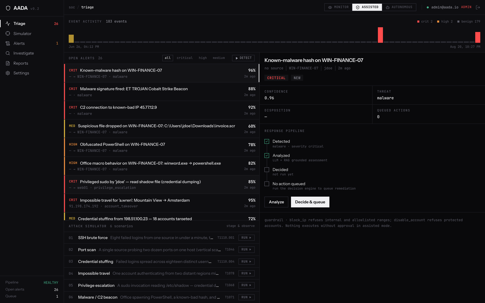
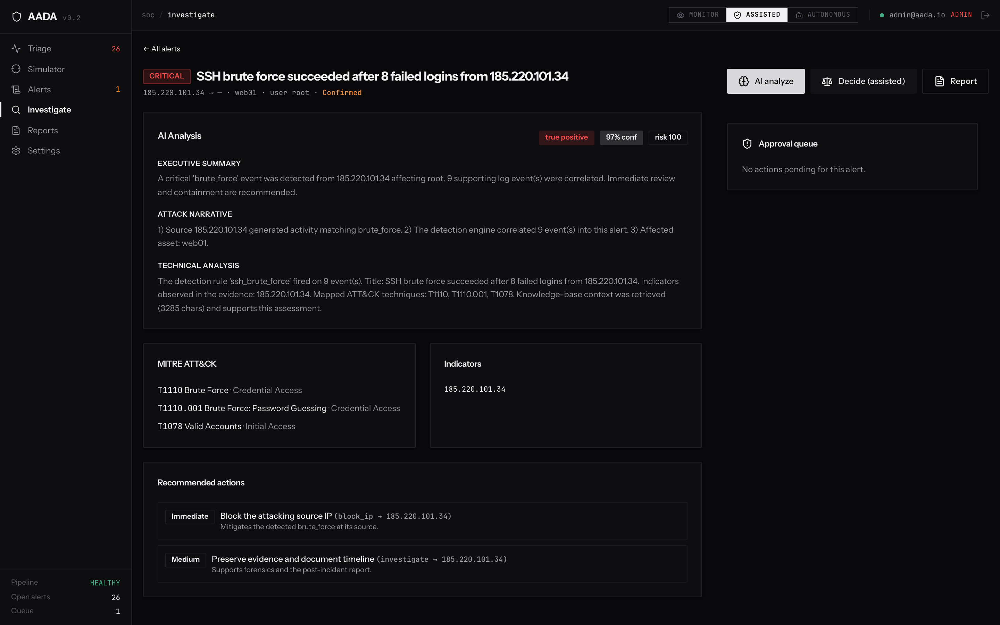
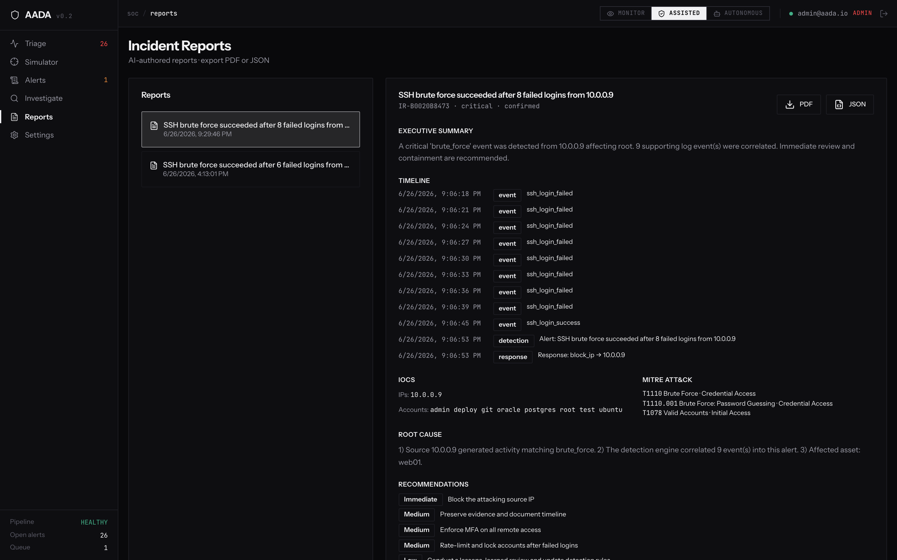
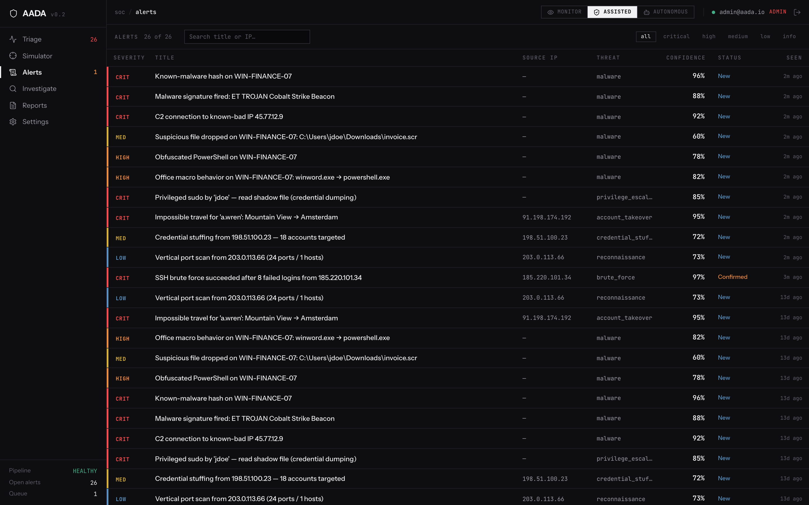

# AADA — Autonomous Defense Agent

AADA is an AI-powered SOC agent. It takes in raw security logs, figures out what's an attack, reasons about it with an LLM that's grounded in a cybersecurity knowledge base, scores the risk, and either recommends or (within policy) executes a remediation — always with a human in the loop and everything logged.

[](https://github.com/pranjalm37/autonomous-defense-agent/actions/workflows/backend-tests.yml)
[](https://github.com/pranjalm37/autonomous-defense-agent/actions/workflows/frontend-build.yml)
[](https://www.python.org/downloads/release/python-3110/)
[](LICENSE)

---

## Overview

The idea is to model what a SOC analyst actually does, as a pipeline of small services that each do one job:

```
ingest → detect → analyze (LLM + RAG) → enrich (threat intel) → decide → respond → report
  │         │            │                      │                  │         │         │
 logs    6 rules     SOC analyst          VT/AbuseIPDB/NVD    fuse risk   approval   PDF/JSON
 (5 fmt) +MITRE     (structured output)   (cache+ratelimit)  +confidence  +rollback  +timeline
                                                                          +guardrails
                            ▲ every step writes an immutable audit log ▲
```

It runs fully offline out of the box — no API keys needed, since deterministic local providers stand in for the LLM, embeddings, and threat-intel feeds. Add real keys and it switches to live providers, no code changes required.

> This is an educational/research project. The remediation backends are safe in-memory simulations. Don't wire in a real firewall or account system without keeping the approval workflow in front of it.

## Features

- Multi-format log ingestion (JSON, CSV, SSH, auth, web) normalized to one event schema
- Detection engine with 6 rules (SSH brute force, port scan, credential stuffing, impossible travel, privilege escalation, malware/IOC), risk scoring, and MITRE ATT&CK mapping
- RAG knowledge base (MITRE, OWASP, Sigma, NIST, IR playbooks) backed by ChromaDB, with OpenAI or offline embeddings
- SOC analyst that produces structured LLM output — summary, technical detail, MITRE tags, risk score, recommended actions — grounded in retrieved context
- Decision engine that fuses detection + LLM + threat intel + RAG into one risk/confidence score, with Monitor / Assisted / Autonomous modes
- Response engine with 5 remediation actions (alert, block IP, disable account, ticket, increase logging), an approval workflow, rollback, and guardrails that refuse to block internal IPs or disable protected accounts
- Threat intel integrations (VirusTotal, AbuseIPDB, NVD) with caching, rate limiting, retry/backoff, and graceful degradation when a provider is down
- JWT auth with three roles (viewer / analyst / admin) and a permission map
- An immutable audit log covering every user, model, and remediation action
- A React dashboard (Dashboard, Alerts, Investigations, Reports, Settings)

## Architecture

The backend keeps the core logic pure — rules, signal fusion, decision policy, and report building are all plain functions over plain inputs — with I/O and provider swapping (live vs. offline) pushed to the edges. See [docs/ARCHITECTURE.md](docs/ARCHITECTURE.md) for diagrams.

| Concern | Component |
|---|---|
| API | FastAPI (async), 42 REST endpoints across 13 modules |
| Persistence | PostgreSQL 16 (11-table schema, SQLAlchemy 2.0 async) |
| Retrieval | ChromaDB vector store + embedding providers |
| Tooling | MCP server exposing 6 security tools |
| Frontend | React SPA served by nginx, reverse-proxying the API (single origin) |

## Installation

### Prerequisites
- Docker + Docker Compose (recommended), **or**
- Python 3.11 + Poetry and Node.js 18+ for running things locally

### Run with Docker

```bash
cp .env.example .env          # then edit .env — see Configuration below
docker compose up -d --build
docker compose ps             # services should report healthy
```

| Service | URL |
|---|---|
| Dashboard (SPA) | http://localhost:8080 |
| API docs (Swagger) | http://localhost:8000/docs |
| Health | http://localhost:8000/api/v1/health |

Log in with the `DEFAULT_ADMIN_EMAIL` / `DEFAULT_ADMIN_PASSWORD` you set in `.env`.

Stop with `docker compose down` (add `-v` if you also want to drop the database volume).

## Configuration

Everything's set via environment variables. Copy `.env.example` to `.env` and fill in the required ones — the rest have reasonable defaults.

| Variable | Required | Notes |
|---|---|---|
| `SECRET_KEY` | ✅ | JWT signing key — generate with `openssl rand -hex 32` |
| `POSTGRES_PASSWORD` | ✅ | database password |
| `DEFAULT_ADMIN_PASSWORD` | ✅ | bootstrap admin password (seeded on first start) |
| `DEFAULT_ADMIN_EMAIL` | | bootstrap admin email (default `admin@aada.io`) |
| `OPENAI_API_KEY` | | enables live LLM + embeddings; falls back to offline if unset |
| `VIRUSTOTAL_API_KEY` | | enables live IP/file reputation lookups |
| `ABUSEIPDB_API_KEY` | | enables live IP abuse lookups |
| `NVD_API_KEY` | | raises the NVD CVE rate limit |

`.env` is git-ignored and should never be committed — only `.env.example` (placeholders) is tracked.

## Usage

Once the stack is up, run the included demo to see the whole attack → detection → defense loop:

```bash
./demo_attack.sh
```

It stages a live SSH brute-force attack and walks through every stage: ingest, detect, AI analysis, decision, approval, block, rollback, audit. Point it at an internal IP to see the safety guardrail kick in and refuse the action:

```bash
ATTACKER_IP=10.0.0.9 ./demo_attack.sh
```

You can also drive things from the dashboard (http://localhost:8080) or Swagger (http://localhost:8000/docs). [DEMO.md](DEMO.md) has a full walkthrough and [docs/API.md](docs/API.md) has the endpoint reference.

### Local development

```bash
# Backend
cd aada-backend && poetry install
uvicorn app.main:app --reload                    # http://localhost:8000/docs
pytest tests/ -q --ignore=tests/test_auth.py     # 188 offline tests

# Frontend
cd aada-frontend && npm install && npm run dev   # http://localhost:5173
```

## Screenshots

**Triage dashboard** — event activity, open alerts by severity, the response pipeline for whichever alert is selected, and the attack simulator for staging scenarios.



**AI analysis** — executive summary, attack narrative, MITRE ATT&CK mapping, and confidence-scored recommended actions for a single alert.



**Incident report** — auto-generated timeline, IOCs, root cause, and recommendations, exportable as PDF or JSON.



**Alerts** — full alert list with severity, confidence, and status.



All four are from a real local run: `docker compose up -d --build` followed by `./demo_attack.sh` plus a few staged scenarios through the attack simulator, no fabricated data.

## Project structure

```
.
├── docker-compose.yml          full-stack orchestration (db, chroma, backend, frontend)
├── demo_attack.sh              end-to-end attack → defense demo
├── docs/                       architecture + API reference
├── aada-backend/               FastAPI service
│   ├── app/
│   │   ├── api/v1/endpoints/    REST endpoints (auth, events, detection, …)
│   │   ├── services/            detection · rag · ai_analyst · decision · response · reporting
│   │   ├── integrations/        VirusTotal / AbuseIPDB / NVD clients
│   │   ├── mcp_server/          MCP tool server (6 security tools)
│   │   ├── models/               SQLAlchemy models (source of truth for the schema)
│   │   └── core/, db/, schemas/
│   └── tests/                   unit · API · attack-simulation suites
└── aada-frontend/               React + TypeScript + Tailwind dashboard
```

## Tech stack

| Layer | Technology |
|---|---|
| Backend | Python 3.11, FastAPI (async), SQLAlchemy 2.0, Pydantic v2 |
| Data | PostgreSQL 16 (asyncpg), ChromaDB |
| AI | OpenAI API (chat + embeddings), RAG, deterministic offline fallbacks |
| Integrations | httpx clients (VirusTotal / AbuseIPDB / NVD), MCP tool server |
| Frontend | React 18, TypeScript, Vite, Tailwind, shadcn/ui, React Query, Zustand |
| Infra | Docker multi-stage builds, docker-compose, nginx |
| Quality | pytest (188 tests), structlog (JSON logs), 42 REST endpoints |

## Roadmap

What's not built yet, roughly in the order it'd get tackled:

- **Wire the MCP tools into the analyst's reasoning loop.** The 6 security
  tools and the SOC analyst both exist, but the analyst doesn't call them
  itself yet — it's a tool-calling agent, not just a single structured-output
  request.
- **WebSocket live event streaming**, so the dashboard updates as events and
  alerts come in instead of polling.
- **Redis for caching and pub/sub.** The integrations cache layer is already
  built against a swappable interface (`TTLCache`/`NullCache`) for exactly
  this — there's no live Redis client wired in yet, just the interface it'd
  drop into.
- **A background task queue (ARQ or Celery).** Detection runs and
  long-running analysis currently happen on the request path.

## Contributing

PRs welcome — see [CONTRIBUTING.md](CONTRIBUTING.md) for setup, conventions, and
what to know before opening one.

## License

MIT — see [LICENSE](LICENSE).

## Further reading

- [DEMO.md](DEMO.md) — run, use, and demo the attack → defense loop
- [docs/ARCHITECTURE.md](docs/ARCHITECTURE.md) — system design + diagrams
- [docs/API.md](docs/API.md) — REST API reference (42 endpoints)
- [aada-backend/TESTING.md](aada-backend/TESTING.md) — testing strategy
- [DEPLOYMENT.md](DEPLOYMENT.md) — deployment & operations
