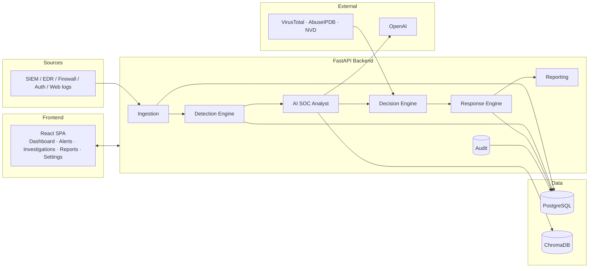
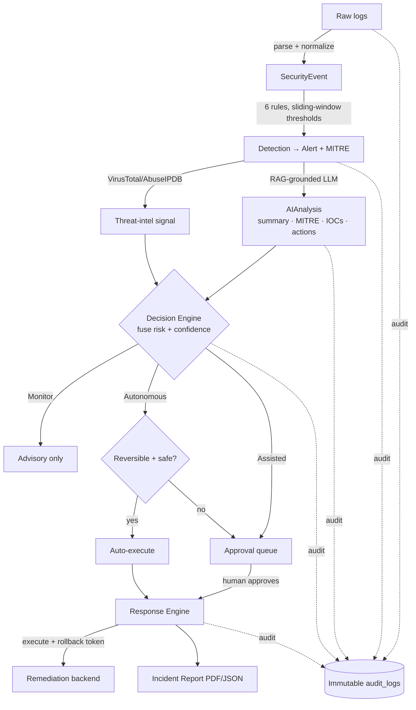
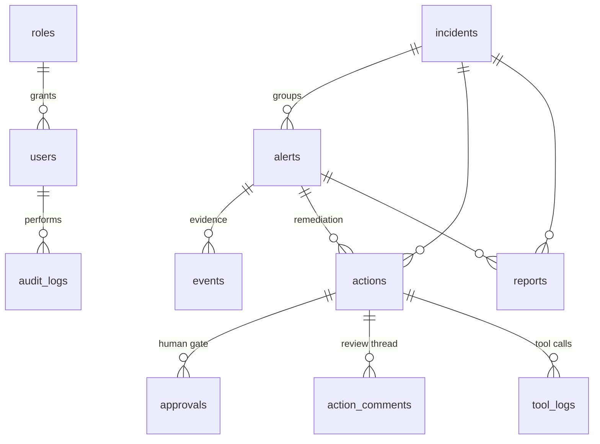

# Architecture

AADA is a layered, event-driven SOC agent. Telemetry flows through a pipeline of
independent services, each with a single responsibility, joined by the database and
a shared audit trail. Every service is unit-testable in isolation because external
dependencies (LLM, vector store, threat-intel APIs, remediation backends) sit behind
swappable provider interfaces with offline fallbacks.

## System context

## The pipeline

## Services

| Service | Responsibility | Key design |
|---|---|---|
| **Ingestion** (`services/ingestion`) | Parse 5 log formats → one normalized schema | Per-format parsers + a central normalizer (field aliasing, IP/severity/timestamp coercion). Raw kept in `raw_payload`, canonical in `normalized_payload`. |
| **Detection** (`services/detection`) | 6 threshold/window rules → alerts | Pure `BaseRule.evaluate(events)`; risk = severity × confidence × volume × asset; MITRE catalog. |
| **RAG** (`services/rag`) | Retrieve cybersecurity knowledge | Chunk → embed → ChromaDB (HNSW/cosine). `OpenAIEmbeddingProvider` + offline `HashingEmbeddingProvider`. |
| **AI Analyst** (`services/ai_analyst`) | LLM analysis grounded in evidence + RAG | OpenAI **structured outputs** (schema-enforced JSON); deterministic offline provider for tests. |
| **Decision** (`services/decision`) | Fuse all signals → one risk/confidence + disposition | Weighted fusion + corroboration; deterministic mode-policy tree (Monitor/Assisted/Autonomous). |
| **Response** (`services/response`) | Execute approved actions, roll back | Handler per action with `execute`/`rollback`; guardrails; status machine. |
| **Reporting** (`services/reporting`) | 6-section incident reports | Builder from evidence; **dependency-free PDF writer** + JSON. |
| **Integrations** (`integrations`) | VirusTotal / AbuseIPDB / NVD | Shared base client: cache + token-bucket rate limit + retry/backoff + typed errors. |
| **MCP server** (`mcp_server`) | 6 tools over the Model Context Protocol | Transport-agnostic registry; stdio server. |
| **Audit** (`services/audit`) | Immutable accountability trail | Append-only; categories: user / ai / remediation / tool. |

## Data model (11 tables, UUID PKs)

The **ORM models are the single source of truth** for the schema — the app creates
tables via `Base.metadata.create_all` on startup (Alembic takes over once migrations
are generated). Postgres-native types are used throughout: `INET` (fast subnet
queries), `JSONB` (flexible AI output), `ARRAY` (MITRE techniques).

## Cross-cutting design principles

- **Provider abstraction + offline fallbacks** — OpenAI↔hashing embeddings,
  Chroma↔in-memory store, real↔heuristic LLM, real↔simulated remediation. The whole
  system runs and is tested with zero network or API keys; production is a config swap.
- **Pure core, thin edges** — detection rules, fusion, the decision tree, report
  building, and handlers are pure functions over plain inputs; DB/HTTP live at the
  endpoints. This is why 169 tests run fast and offline.
- **Human-in-the-loop by default** — the agent *proposes*; consequential actions
  require approval. Autonomous mode only auto-executes reversible, low-blast actions.
- **Everything is audited** — append-only `audit_logs` records who/what/when/where +
  before→after, for compliance and forensics.
- **Defense in depth** — RBAC enforced server-side; the UI gating is UX only.

## Operating modes

| Mode | Behavior |
|---|---|
| **Monitor** | Observe and recommend only; the agent never acts. |
| **Assisted** *(default)* | Every action queued for human approval (HITL). |
| **Autonomous** | Auto-execute reversible, low-blast actions above a risk/confidence bar; escalate everything else. |
